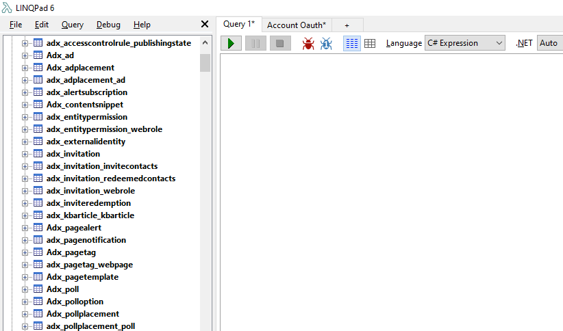
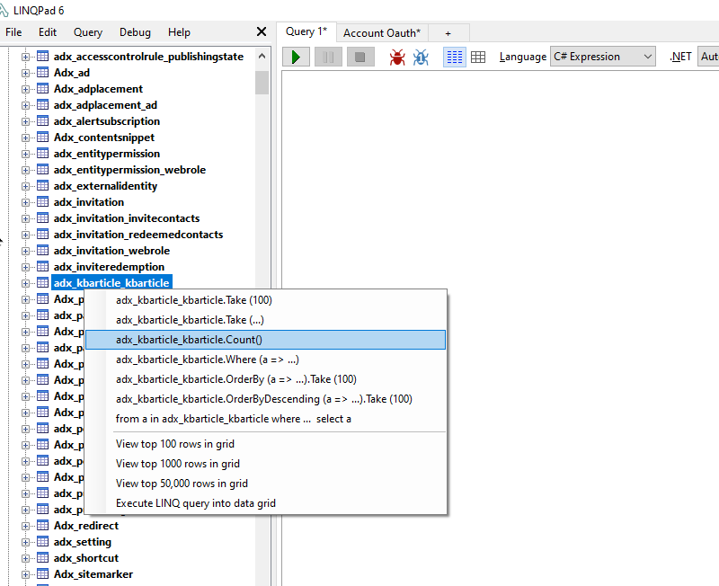
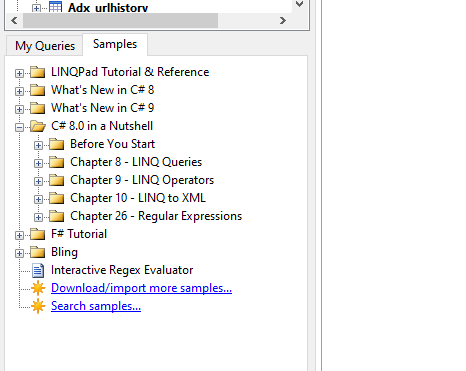

# Dataverse Driver for LINQPad 6

[The original LINQPad Driver for Dynamics CRM](https://github.com/kenakamu/CRMLinqPadDriver) (as Dataverse was known back then) was written by [Kenichiro Nakamura](https://github.com/kenakamu). It used the SOAP endpoint along with CrmSvcUtil to generate the early bound classes needed to show the entities in LINQPad. It was a static driver, meaning that you had to regenerate the context if you had new metadata e.g. new fields, entities etc.

This new driver is a dynamic driver that uses [Microsoft.PowerPlatform.Cds.Client](https://github.com/microsoft/PowerPlatform-CdsServiceClient) assemblies which target .NET Core. The Tables (Entities) and associated metadata are regenerated everytime LINQPad is opened, so that you don't need to worry about keeping Dataverse Metadata and LINQPad context in sync.

The _Microsoft.PowerPlatform.Cds.Client_ package is still in alpha, so there might be some naming changes/bugs which you can log in this repo for me to triage. I can then either fix it in the driver, or report it on the _Microsoft.PowerPlatform.Cds.Client_ repo, if it is not a driver code issue.

# Connecting to your Dataverse Environment

[Microsoft.PowerPlatform.Cds.Client](https://github.com/microsoft/PowerPlatform-CdsServiceClient) supports three kinds of authentication:

1. Application Id/Secret
2. Application Id/Certificate Thumbprint
3. OAuth

After installing the driver from nuget, you can start using this driver by clicking _Add Connection_ link on LINQPad. You will be presented with the dialog below.

You can then choose the appropriate connection method and enter the connection details. [Scott Durow](https://twitter.com/scottdurow) has as great video on YouTube on how to do this, which you can use to setup your Application Registration and create the Application User. The redirect URL in the Application registration has to be **http://localhost**

# Running LINQ Query

After entering the required details on the connection dialog, the context would be generated and you should see all the tables on the left hand side.

You can either write a new LINQ query on the query window, or right click on the table name, to see some quick suggestions.

LINQPad has a whole bunch of samples on how to craft your LINQ queries, in case you don't know how to query in LINQ and want to learn the syntax. LINQ is very similar to SQL in syntax, but more powerful than SQL.

I have also given five samples that illustrate the power of LINQPad and how you can use the driver to query Dataverse.

# Calling Dataverse API

You can use _DataverseClient_ property to access the CdsServiceClient object. Once you have access to this object you can then basically do any operations that are supported by the client.

# Thank You

- Kenichiro Nakamura for writing the original driver, that I still use
- Gayan Perara for CRM Code Generator, which was the first one to use T4 templates for generating early bound classes
- Jo Albahari for creating LINQPad
- People who helped me with testing - TBC
